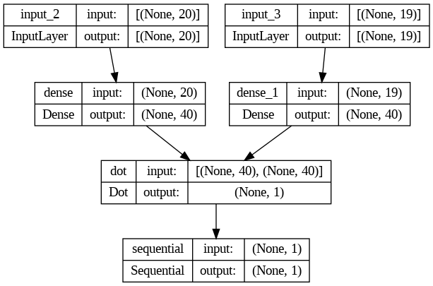
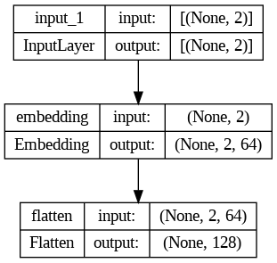
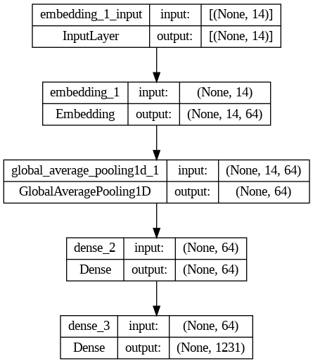
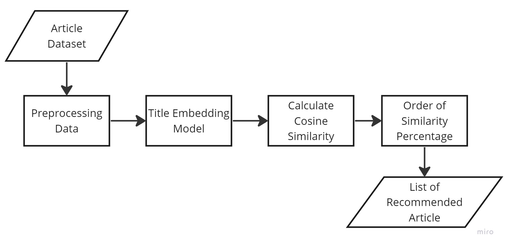

  

# Machine-Learning
Machine Learning Repository for CS23-PS276 Bangkit Capstone Project "Sahabat Lansia"

# Dataset Collection
- [Ketentuan Synthetic Data Generation](Caregiver-Recommendation/Data-Collecting/Landasan_Statistik)
- [Caregiver and Lansia Dataset](https://drive.google.com/drive/folders/1ZRUIHIf0sd1Qo0detEMIWP_2Hy1VF5N9?usp=sharing)
- [Article Titles Dataset for Train The Model](https://github.com/CS23-PS276/Machine-Learning/tree/27510bc9532b5f2a80089bbf9d5640a8adeb97ce/Artikel-Recommendation/Data%20Collecting/Combined%20Dataset)
- [Article Dataset with Content](https://github.com/CS23-PS276/Machine-Learning/tree/main/Artikel-Recommendation/Data%20Collecting/Final%20Dataset%20With%20Content)

# Model Development Notebook
- [Caregiver Recommendation System](Caregiver-Recommendation/Model-Development/Newest-Model/14_6_Model_Used_2_Model.ipynb)
- [Article Recommendation System](https://github.com/CS23-PS276/Machine-Learning/blob/27510bc9532b5f2a80089bbf9d5640a8adeb97ce/Artikel-Recommendation/Model%20Dataset%20Without%20Content/Model_Rekomendasi_Artikel_No_Konten.ipynb)

# Model Architecture
Numerical Model

  

City Embedding Model

  

Article Model

  

# Cloud Functions
- [Caregiver Cloud Functions](Caregiver-Recommendation/Cloud-Functions)
- [Article Cloud Functions](https://github.com/CS23-PS276/Machine-Learning/tree/2ba910e6de489cfe570260df3c5e055cfa85aabb/Artikel-Recommendation/Cloud%20Functions)

# API URL
- [caregiver-all-function](https://caregiver-all-function-jo6twt65na-et.a.run.app)
- [function-article](https://function-article-jo6twt65na-et.a.run.app)

# Flow
Caregiver Recsys Flow

Article Recsys Flow

  

# Postman Test
Caregiver Recsys
- Open Postman
- Fill URL Request bar with https://caregiver-all-function-jo6twt65na-et.a.run.app
- Select method POST
- Go to Header tab and add key-value Content-Type: application/JSON
- Go to Body tab and select raw
- Fill the Body code with input
- Example input:
{
  "Mobilitas":2,
  "Penyakitlain":0,
  "Hipertensi":0,
  "Diabetes":1,
  "Reumatik":0,
  "Penyakitjantung":0,
  "Asma":0,
  "Stroke":1,
  "Mengurusrumah":1,
  "Membantupergerakandanaktivitasfisik":4,
  "Membantukonsumsiobatdanmakanan":4,
  "Mengecekkesehatanrutinsecaramandiri":1,
  "Mendampingidanmenjaga":4,
  "Memasangkanalatmediskhusus":1,
  "Memeriksakanrutinkedokter":1,
  "Indonesia":0,
  "Inggris":0,
  "Jawa":1,
  "Sunda":0,
  "Melayu":0,
  "Kota": "Kabupaten Ngawi"
}
- Send the request

Article Recommendation Recsys
- Open Postman
- Fill URL Request bar with https://function-article-jo6twt65na-et.a.run.app
- Select method POST
- Go to Header tab and add key-value Content-Type: application/JSON
- Go to Body tab and select raw
- Fill the Body code with input
- Example input:
{
  "judul" : "Penyebab Hiperlakrimasi atau Mata Berair"
}
- Send the request
